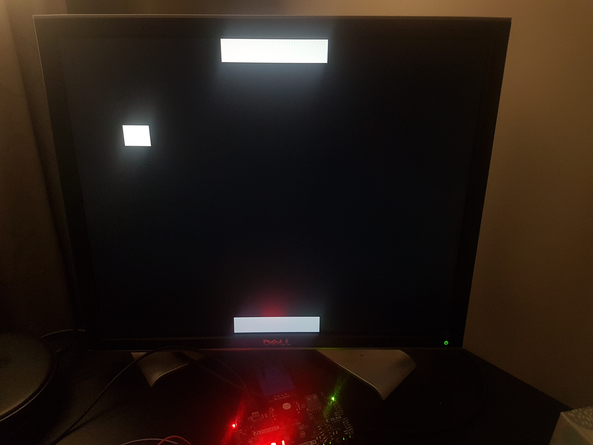

-----------------------------------------------------------------------

# Pong on an FPGA with VHDL

A simple pong game using a [Basys 3 Artix-7 FPGA](https://digilent.com/shop/basys-3-artix-7-fpga-trainer-board-recommended-for-introductory-users/).

# Project description
-----------------------------------------------------------------------

## Input
A joystick with 2 potentiometers (only one is used) controls the paddle movement. A simple voltage divider takes the 3.3V supplied by the Pmod ports and gives a range of 0V to 1V from the potentiometer, that is then read by the analog-to-digital converter on the FPGA. Then only other input is the center push button (BTNC), that acts as a reset.

## Ouput
The game is displayed on a monitor through VGA output. The score is displayed on the 4-digit 7-segment display onboard the FPGA. The score of the player on the bottom screen corresponds to the two left-most digits, the remaining ones for the player on top.

## Code
Most of the code was written entirely by me, though I based my vga output controller on the example on [Digilent's GitHub](https://github.com/Digilent/Basys-3-GPIO/blob/master/src/hdl/vga_ctrl.vhd). I also used [this tutorial](http://www.unilim.fr/pages_perso/vahid/XADCinBasys3.html) to get the ADC IP working. Finally some bits of code were taken from material from my INF3500 class at Polytechnique Montréal (given my Pierre Langlois), comments in the code indicates which parts those are.

## Running the project
- Connect the ground to pin JA1, and the variable voltage from a potentiometer(max 1V) to JA7. 
- Connect the monitor with vga cable to the FPGA board.
- After connecting the FPGA board to a computer via USB, navigate to the /src directory in command line. The tcl commands in [this file](src/Pong.tcl) should be put in the vivado command line, in mode tcl. This can be done by running "your_path_to_vivado_bin_folder/vivado -mode tcl" once in the correct directory. 
- To start the game, press the BTNC push button.

## Future work
There are a few things that I would like to add to this project eventually. The first being a proper second player input, since currently one joystick is used to control both players. Having a video output now allows for other exciting things, such as generating a Fractal in real-time, to add an interesting background to this game. I'll update this project if these things come to fruition.
